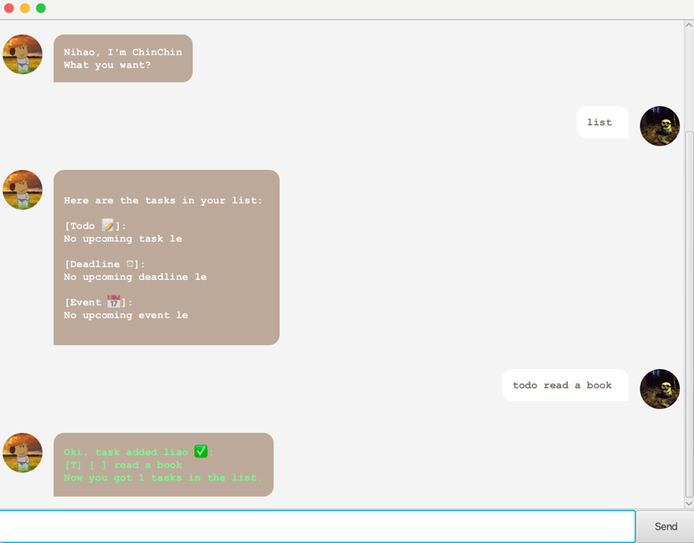

# ChinChin User Guide



## Introduction

Welcome to ChinChin. This simple and humble yet powerful CLI-based productivity tool helps you keep track of todos,
deadlines, and events effortlessly. Designed for users who prefer lightweight tools over complicated apps, ChinChin
makes managing tasks quick and easy.

## Adding deadlines

// Describe the action and its outcome.

// Give examples of usage

Example: `keyword (optional arguments)`

// A description of the expected outcome goes here

```
expected output
```

## Feature ABC

// Feature details

## Feature XYZ

// Feature details