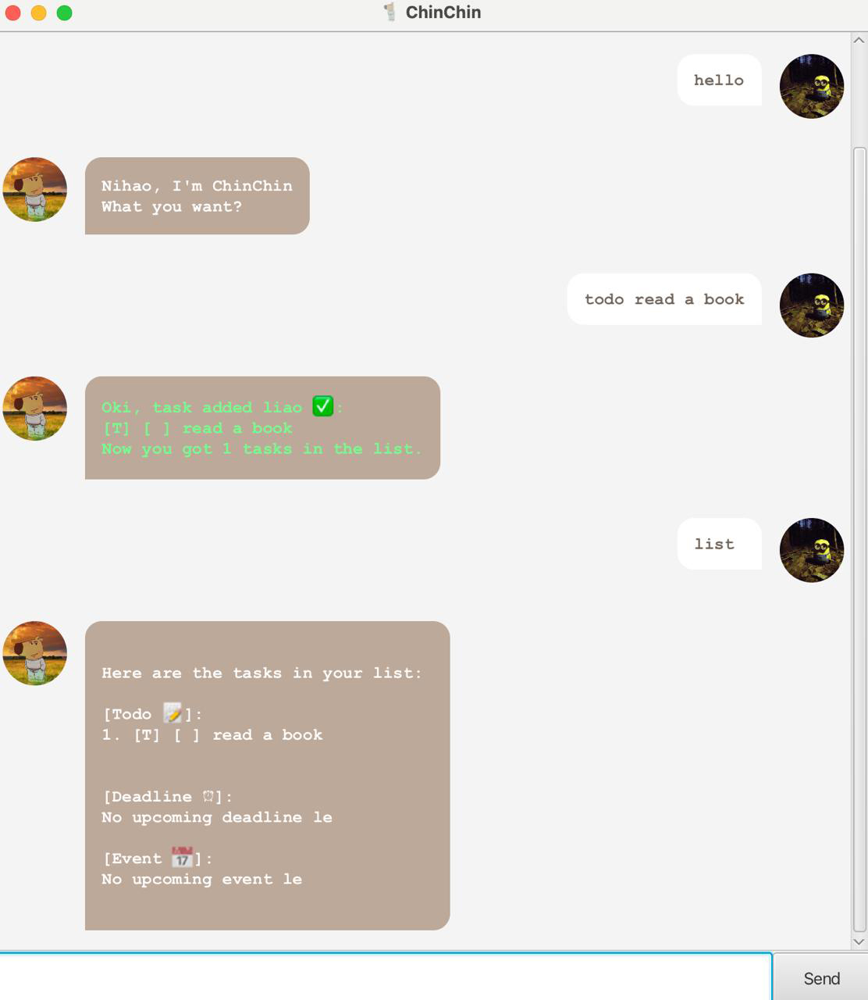

# ChinChin User Guide



## Introduction

Welcome to ChinChin. This simple and humble yet powerful CLI-based productivity tool helps you keep track of todos,
deadlines, and events effortlessly. Designed for users who prefer lightweight tools over complicated apps, ChinChin
makes managing tasks quick and easy.

It supports commands like:

- `hi` - ChinChin greets you
- `bye` - ChinChin says goodbye
- `todo` - Add a todo task
- `deadline` - Add a deadline task
- `event` - Add an event task
- `list` - List all tasks
- `mark` - Mark a task as done
- `unmark` - Unmark a task as undone
- `delete` - Delete a task
- `summary` - Gives a summary on the number of tasks
- `view` - View the tasks on a specific date
- `find` - Find the task with the specific keyword

---

## Quick Start
### Requirements
- Ensure that you have installed **Java 17** on your computer
- Download the latest version of ChinChin.jar from GitHub release

### Running ChinChin
- Open **terminal** (MacOS) or **command prompt** (Windows)
- Navigate to the directory where ChinChin.jar is installed
- Run the following command
`java -jar ChinChin.jar`

## Main Feature - Add Tasks (Todo, Deadline, Event)
Adds a new task to your list. This can be either a simple to-do, a deadline with a due date/time, or an event scheduled
for a specific time.

Command: ```todo```, ```deadline```, ```event```

### Todo
A simple task without a date or time attached to it.

Syntax: 
`todo <TASK_DESCRIPTION>`

Example: 
`todo read a book`

```expected output```
```
Oki, task added liao ✅:
[T] [ ] read a book
Now you got 1 task in the list.
```

### Deadline
A task with a deadline.

Syntax: 
`deadline <TASK_DESCRIPTION> /by <dd-MM-yyyy HHmm>`

Example: 
`deadline read a book /by 12-12-2025 1234`

```expected output```
```
Oki, task added liao ✅:
[D] [ ] read a book
DEADLINE: Dec 12 2025 12:34 pm
Now you got 1 task in the list.
```

### Event
A task that has a starting date and an ending date.

Syntax: 
`event <TASK_DESCRIPTION> /from <dd-MM-yyyy HHmm> /to <dd-MM-yyyy HHmm>`

Example: 
`event read a book /from 12-12-2025 1234 /to 12-12-2025 2345`

```expected output```
```
Oki, task added liao ✅:
[E] [ ] read a book (FROM: Dec 12 2025 12:34 pm TO: Dec 12 2025 11.45 pm)
Now you got 1 task in the list.
```

## Exit Program
ChinChin would say goodbye and close the program.

Command: ```bye```,```goodbye```

Example: 
`bye`

```
expected output
```
```
Bye! Hope to see you again soon.
```

## Delete Tasks
ChinChin would help to delete the task with the specified index.

Command: ```delete```

Syntax: 
`delete <TASK_INDEX>`

Example: 
`delete 2`

```
expected output
```
```
Okay Boss, removed liao:
[T] [ ] read a book
```

## Find Task
ChinChin would help to collate all the tasks with the given keyword.

Command: ```find```

Syntax: 
`find <KEYWORD>`

Example: 
`find book`

```
expected output
```
```
Here are some of the matches:
1. [T] [ ] read a book
```

## List All Tasks
ChinChin would help to list out all the tasks, starting with `Todo`, `Deadline`, and finally `Event`.

Command:
```list```

Example: 
`list`

```expected output```
```
Here are the tasks in your list:

[Todo 📝]:
1. [T] [ ] read a book

[Deadline ⏰]:
2. [D] [ ] read a book
DEADLINE: Dec 12 2025 12:34 pm

[Event 📅]:
No upcoming event le.
```

## Mark Task As Complete
ChinChin would help to mark specified task as complete.

Command: 
```mark```

Syntax: 
`mark <TASK_INDEX>`

Example: 
`mark 2`


```expected output```
```Orh, marked the task as done liao:
[T] [✔️] read a book
```

## Unmark Task As Incomplete
ChinChin would help to unmark specified task as complete.

Command: 
```unmark```

Syntax: 
`unmark <TASK_INDEX>`

Example: 
`unmark 2`

```expected output```
```Orh, marked the task as undone liao:
[T] [✔️] read a book
```

## View Summary Of Tasks
ChinChin will help to display the summary of your tasks, which is the count of Todo, Deadline and Event

Command: 
```Summary```

Example: 
`summary`

```expected output```
```
Here's your summary:
📝Todos       : 1
⏰Deadlines   : 1
📅Event       : 0
```

## Show The Help For Each Commands
ChinChin would display all the available commands and what they do

Command: ```help```

Example: `help`

ChinChin would advise you on how to use this command

Syntax: 
`help <COMMAND>`

Example: `help find`

```expected output```
```How to use 'FIND'? Just type
find [keyword]
```

## View Tasks On Date
ChinChin would display all the tasks on that date for you

Command: ```view```

Syntax: 
`help <DATE>`

Example: `view /on 12/12/2025`

```expected output```
```
Schedule for 2025-12-12:

[Deadlines]:
1. read a book - Due at 12:34 pm
```

## Supported Date and Time Formats
For all commands requiring dates and times, ChinChin supports these formats:

Syntax: 
    - `<dd-MM-yyyy HHmm>`
    - `<dd/MM/yyyy HHmm>`

Examples:
    - With time: `deadline submit report /by 25-12-2023 1400`
    - Without time: `event team meeting /from 01/01/2024 /to 03/01/2024`
      (defaults to midnight if time is not provided)

Default Behavior:
   If you omit the time (`HHmm`), it will default to midnight (`00:00`).

### Deadline
Syntax: 
`deadline <task description> /by <dd-MM-yyyy HHmm>`

Example: 
`deadline read a book /by 12-12-2025`

```expected output```
```
Oki, task added liao ✅: 
[D] [ ] Read a book
DEADLINE: Dec 12 2025 12:00 am
Now you got 1 tasks in the list.
```

### Event
Syntax: 
`event <task description> /from <dd-MM-yyyy HHmm> /to <dd-MM-yyyy HHmm>`
 
Example: 
`event complete CS2107 Assignment 1 /from 21-02-2025 1200 /to 21/02/2025`.

```expected output```
```
Oki, task added liao ✅:
[E] [ ] complete CS2107 Assignment 1 (FROM: Feb 21 2025 12:00 pm TO: Feb 21 2025 12:00 am)
Now you got 1 tasks in the list.
```